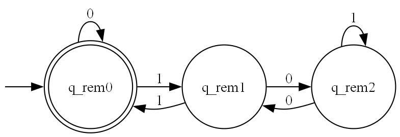
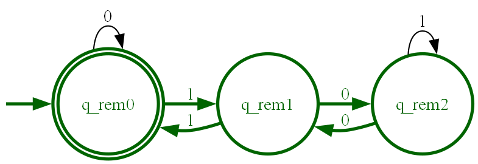
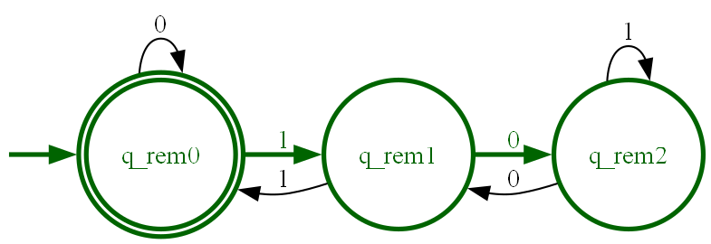

# DFA Engine & Visualizer

A simulation engine for **Deterministic Finite Automata (DFA)**. This tool enables the definition, execution, and visualization of automata using a high-performance Python core designed for algorithmic efficiency.

Unlike standard educational tools, this engine prioritizes **O(1) runtime execution** and strictly separates logic from rendering, making it a robust implementation of Automata Theory concepts.

[](https://github.com/iago-fernandez/dfa-visualizer/releases)
[](requirements.txt)
[](LICENSE)

## Core Engineering

Designed with infrastructure efficiency in mind:

* **Time Complexity:** Constant time $O(1)$ state transitions using hash-map lookups, independent of automaton size.
* **Space Complexity:** Rigid memory allocation via `__slots__` to minimize footprint during high-volume instantiations.
* **Visual Optimization:** Algorithms to detect and compress contiguous ASCII ranges (e.g., merging `a,b,c,...,z` into `a-z`) to reduce visual clutter in generated graphs.

## Mathematical Definition

The engine implements a DFA as a formal 5-tuple $M = (Q, \Sigma, \delta, q_0, F)$:

* $Q$: Finite set of states (efficiently stored as string hashes).
* $\Sigma$: Finite set of input symbols (alphabet).
* $\delta$: Transition function $\delta: Q \times \Sigma \rightarrow Q$.
* $q_0$: Initial state ($q_0 \in Q$).
* $F$: Set of accepting states ($F \subseteq Q$).

## Provided Examples

The repository includes a set of pre-configured automata in the `examples/` directory. These files serve as both functional tests for the engine and reference templates for the configuration DSL.

### 1. Modulo 3 Calculator

**File:** `examples/binary_divisible_by_3.txt`

This automaton implements cyclic logic to calculate the remainder of a binary number divided by 3. It demonstrates the engine's capability to render symmetrical, non-linear state relationships.

> The following diagrams were automatically generated by the app as `png` files in the `assets/` folder (such directory is created when the program is run for the first time).

**Base Topology:**



**Execution Traces:**

* **Acceptance:** Input `1001` (Decimal 9). The path cycles through the states and correctly returns to `q_rem0` (remainder 0).

  

* **Rejection:** Input `10` (Decimal 2). The path halts at `q_rem2`, identifying the remainder as 2.

  

### 2. Email Validator

**File:** `examples/email_validator.txt`

A complex pattern matcher designed to validate a **custom, arbitrary email format**. It demonstrates how to enforce specific structural constraints (e.g., mandatory digits, length limits) and strict domain allow-listing (`.fr`, `.sat`) within a single state machine.

### 3. Binary Parity Validator

**File:** `examples/binary_odd_validator.txt`

A foundational example for parity checking. The automaton accepts any binary string ending in `1` (odd numbers) and rejects those ending in `0` (even numbers), demonstrating simple state oscillation.

## Project Structure

The repository enforces separation of concerns:

```text
dfa-visualizer/
├── examples/                  # Automata definitions (DSL)
│   ├── binary_divisible_by_3.txt
│   ├── email_validator.txt
│   └── binary_odd_validator.txt
├── src/
│   ├── dfa.py                 # Runtime engine & Graphviz renderer
│   ├── loader.py              # Parsing pipeline & validation
│   └── utils.py               # ASCII range expansion logic
├── assets/                    # Generated visualization artifacts
├── runner.py                  # CLI Entry point
└── requirements.txt           # Dependencies

```

## Installation & Setup

### Prerequisites

* **Python 3.10+**
* **Graphviz**. The binary must be in system PATH.
    * Windows: Download [the installer](https://graphviz.org/download/) from the project's page.
    * Linux: `sudo apt install graphviz`
    * macOS: `brew install graphviz`


### Quick Start

```bash
# Clone this repository
git clone https://github.com/iago-fernandez/dfa-visualizer.git

# Set working directory to the project folder and install dependencies
cd dfa-visualizer
pip install -r requirements.txt
```

## Usage

### Interactive CLI

The `runner.py` script provides a text-based interface for loading models, running simulations, and exporting diagrams on-the-fly.

```bash
python runner.py
```

### Configuration DSL

Automata are defined in plain text files. The parser supports range expansion for required definitions. Check the examples given under the `examples/` directory for more complex implementations.

```text
# Line comments are allowed using '#' as first character
ALPHABET: 0-1
STATES: q0 q1
INITIAL_STATE: q0
FINAL_STATES: q1
TRANSITIONS:
q0 0 q0
q0 1 q1
q1 0 q0
q1 1 q1
```

### Programmatic Integration

The engine is modular and can be imported into other Python projects.

```python
from src.dfa import DFA

# Define the automaton
dfa = DFA(
    states={'q0', 'q1'},
    alphabet={'0', '1'},
    transitions={
        ('q0', '0'): 'q0', ('q0', '1'): 'q1',
        ('q1', '0'): 'q0', ('q1', '1'): 'q1'
    },
    initial_state='q0',
    final_states={'q1'}
)

# Execute logic
is_valid, path, edges = dfa.validate_string("101")

# Render artifact
if is_valid:
    dfa.visualize("output_graph", path, edges)
```

## Contributing

Contributions are welcome. Please ensure your code adheres to the engineering standards defined in [CONTRIBUTING.md](CONTRIBUTING.md).

## License

This project is licensed under the MIT License. See the [LICENSE](LICENSE) file for details.