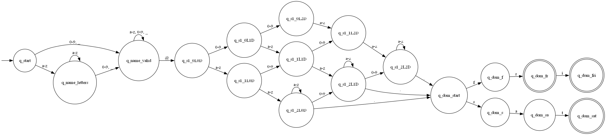

# DFA Visualizer

A modular Python implementation of **Deterministic Finite Automata (DFA)** designed for logic validation and educational visualization. The tool generates real-time synchronized representations of automaton structures and execution paths using **Graphviz**, featuring intelligent edge grouping and range detection.

Beyond simple validation, this project serves as:

* A formal implementation of **Automata Theory** concepts.
* A visualization tool for **computational flow analysis**.
* An example of clean architecture in Python, emphasizing separation between logic, persistence, and rendering.


*Figure 1: Generated visualization showing intelligent edge grouping (e.g., '0-9', 'a-z') and state topology.*

---

## Mathematical Background

A DFA is formally defined as a 5-tuple $M = (Q, \Sigma, \delta, q_0, F)$:

* $Q$: Finite set of states.
* $\Sigma$: Finite set of symbols (alphabet).
* $\delta: Q \times \Sigma \rightarrow Q$: Transition function.
* $q_0 \in Q$: Initial state.
* $F \subseteq Q$: Set of final (accepting) states.

---

## Key Features

* **Interactive CLI**: A robust command-line interface (`runner.py`) for loading models or creating them interactively.
* **File-Based Configuration**: Support for parsing DFA definitions from structured text files.
* **Smart Visualization**:
    * **Edge Grouping**: Automatically aggregates transitions (e.g., compresses `a,b,c...z` into `a-z`) for readable diagrams.
    * **Trace Highlighting**: visually maps the execution path of input strings (green highlighting for active states and transitions).
* **Strict Validation**: Enforces alphabet consistency and transition completeness.

---

## Project Structure

The project follows a modular architecture to separate concerns:

```text
dfa-visualizer/
├── examples/               # Configuration files for DFA models
│   ├── binary_odd_validator.txt
│   └── email_complex_validator.txt
├── src/
│   ├── dfa.py              # Core logic and visualization engine
│   ├── loader.py           # File parsing and validation logic
│   └── utils.py            # Helper functions (range expansion)
├── runner.py               # Main CLI entry point
└── requirements.txt        # Project dependencies
```

---

## Requirements

### System Dependencies

This project requires the **Graphviz binary** to be installed and accessible in the system PATH. The Python library acts as a wrapper and will fail if the core software is missing.

* **Windows**: Download from [graphviz.org](https://graphviz.org/download/). During installation, select "Add Graphviz to system PATH for all users".
* **Linux**: `sudo apt install graphviz`
* **macOS**: `brew install graphviz`

### Python Dependencies

* Python 3.10+
* graphviz (Python wrapper)

---

## Setup

1. **Clone the repository**:
    ```bash
    git clone https://github.com/iago-fernandez/dfa-visualizer.git
    cd dfa-visualizer
    ```
   
2. **Environment setup**:
    It is recommended to use a virtual environment.
    ```bash
    python -m venv venv
    # Windows
    .\venv\Scripts\activate
    # Linux/macOS
    source venv/bin/activate
    ```
   
3. **Install dependencies**:
    ```bash
    pip install -r requirements.txt
    ```

---
   
## Usage

### 1. Interactive Runner
The primary entry point is the `runner.py` script. It offers two execution modes: loading a pre-defined model or creating an automaton interactively step-by-step.

```bash
python runner.py
```

Follow the on-screen prompts to:
1. Load a DFA (e.g., `examples/email_complex_validator.txt`).
2. Generate the structural diagram.
3. Input test strings to validate logic and generate trace diagrams.

### 2. Configuration File Format
You can define custom automata using plain text files. The parser supports character ranges (e.g., `a-z`, `0-9`) for both alphabet definitions and transitions.

**Example: `custom_dfa.txt`**
```text
# Comments are allowed using the hash symbol
ALPHABET: 0-1
STATES: q0 q1
INITIAL_STATE: q0
FINAL_STATES: q1

TRANSITIONS:
# Source Input Destination
q0       0     q0
q0       1     q1
q1       0     q0
q1       1     q1
```

### 3. Programmatic Usage
The project is modular, allowing you to import the core classes into your own Python scripts or Jupyter notebooks.

```python
from src.dfa import DFA

# Define the automaton
dfa = DFA(
    states={'q0', 'q1'},
    alphabet={'0', '1'},
    transitions={
        ('q0', '0'): 'q0',
        ('q0', '1'): 'q1',
        ('q1', '0'): 'q0',
        ('q1', '1'): 'q1'
    },
    initial_state='q0',
    final_states={'q1'}
)

# Validate a specific input string
is_valid, path, edges = dfa.validate_string("101")

# Generate the visualization
# This saves 'output.png' highlighting the execution path
dfa.visualize("output", path, edges)
```
